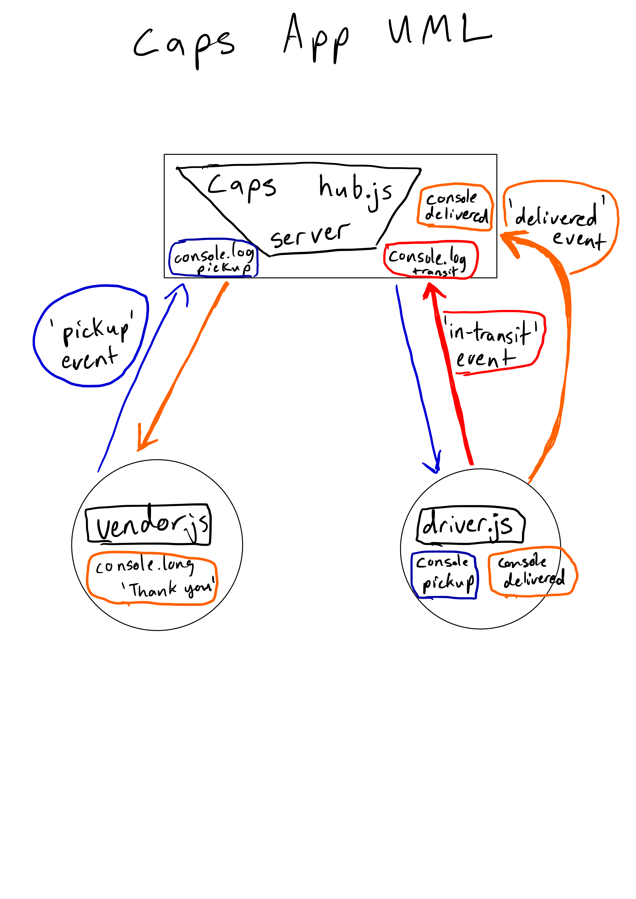

# Lab Class 17

## Project: Caps

### Author: Josh Williams

### Links and Resources
 - [Caps Hub](./caps/hub.js)
 - [Driver](./driver/driver.js)
 - [Vendor](./vendor/vendor.js)

### Setup
#### `.env` requirements 
#####  `/caps/.env`
PORT= Port Number  
#### `/driver/.env`
PORT= Port Number  
HOST= Host, ie 'localhost'  
#### `/vendor/.env`
PORT= Port Number  
HOST= Host, ie 'localhost'  
STORE_NAME= Filler store name  

#### How to initialize and run the application: 
```
git clone https://github.com/josh-williams-401-advanced-javascript/caps.git
```

You need three terminal windows open
#### Window 1:
``` 
cd caps/caps
npm i
nodemon
```
#### Window 2:
``` 
cd caps/driver
npm i
nodemon
```
#### Window 3:
``` 
cd caps/vendor
npm i
nodemon
```
It should be run in this order. Fit them all onto one screen to see how they interact.

#### Tests
No unit tests for this section

#### UML


### 8/31/2020
To get started:

```
git clone https://github.com/josh-williams-401-advanced-javascript/caps.git  

cd caps

npm i

nodemon
```
This will display the results of mock deliveries in the console.