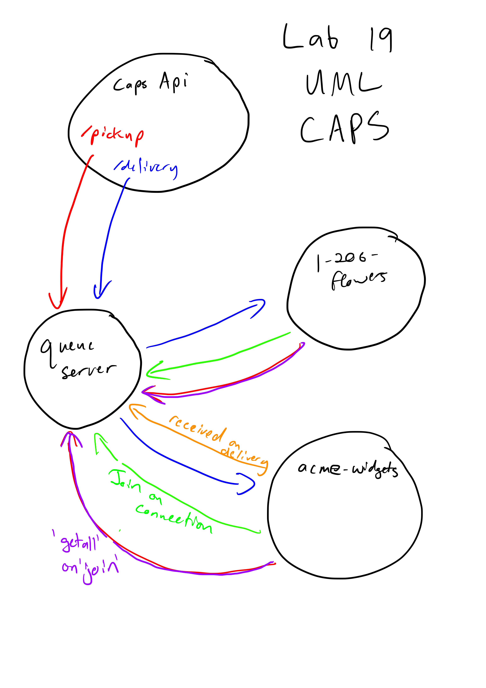
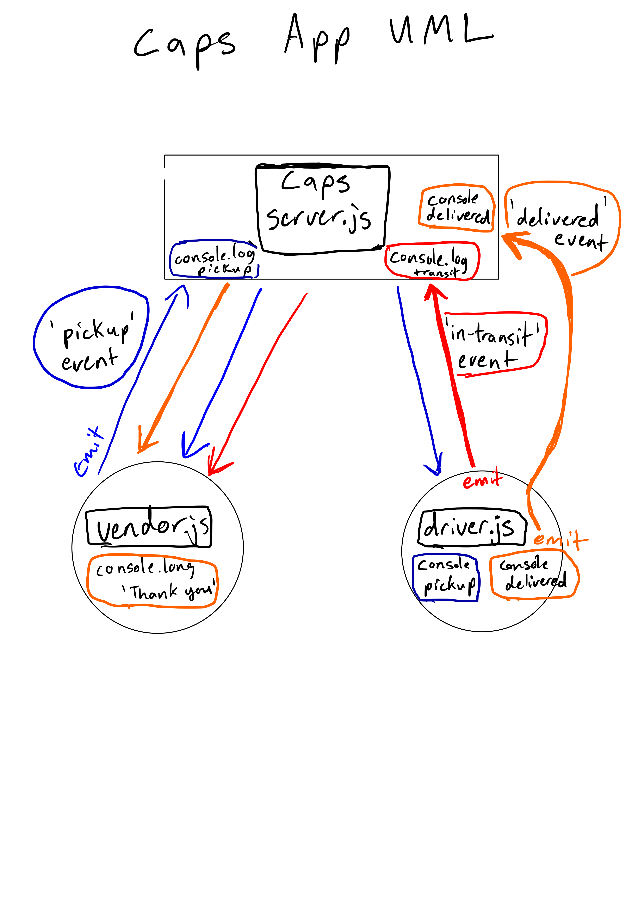

# Lab Class 19

## Project: Caps

### Author: Josh Williams

### Links and Resources
 - [Server](./queue/queue-server.js)
 - [API](./queue/caps-api.js)
 - [Acme Vendor](./queue/acme-widgets.js)
 - [1-206-Flowers Vendor](./queue/1-206-flowers.js)
  
### Setup
#### `.env` requirements 
#####  `/queue/.env`
PORT=

#### How to initialize and run the application: 
```
git clone https://github.com/josh-williams-401-advanced-javascript/caps.git

npm i

cd caps/queue
```
You need four terminal windows open:
#### Window 1:
``` 
nodemon queue-server.js
```
#### Window 2:
``` 
nodemon caps-api.js
```
#### Window 3:
``` 
nodemon acme-widgets.js
```
#### Window 4:
```
nodemon 1-206-flowers.js
```

Run default order with POST `localhost:3001/pickup` and a corresponding custom delivery with POST `localhost:3001/delivery`  
  
Run custom orders with Postman on POST `localhost:3001/pickup` with a __body__ in the following format:
```
{
  "store": "1-206-flowers",
  "orderID": "4023490zdffdg",
  "customer": "Jimi Hendrix",
  "address": "Sweet Home, AL"
 }
```
You can choose either `1-206-flowers` or `acme-widgets`  

Run deliveries with Postman on POST `localhost:3001/delivery/:store/:id`. For best results, use an ID that you have already posted in a pickup.  

Fit all terminals onto one screen to see how they interact. There are no automated orders, so you need to enter them to see them. The queue has a section for each store that is connected via socket, and items are deleted as they are delivered. The orders do not run on the visualization website, but the app registers orders from the website in the terminal.


#### Tests
There are no unit tests. Please use the methods described to test.

#### UML
  


# Lab Class 18

## Project: Caps

### Author: Josh Williams

### Links and Resources
 - [Server](./socket-io/server.js)
 - [Driver](./socket-io/driver.js)
 - [Vendor](./socket-io/vendor.js)
  
### Setup
#### `.env` requirements 
#####  `/socket-io/.env`
PORT=
STORE_NAME=

#### How to initialize and run the application: 
```
git clone https://github.com/josh-williams-401-advanced-javascript/caps.git

cd caps/socket-io
npm i
```
You need three terminal windows open
#### Window 1:
``` 
nodemon server.js
```
#### Window 2:
``` 
nodemon driver.js
```
#### Window 3:
``` 
nodemon vendor.js
```
#### Window 4: - Stretch Goal
```
nodemon express.js
```
Run custom orders with Postman on `localhost:3001/pickup` with Query Params in the following format. This can be used with or without vendor.js:
```
{
  "store": "Flower Power",
  "orderID": "4023490zdffdg",
  "customer": "Jimi Hendrix",
  "address": "Sweet Home, AL"
 }
```


Fit them all onto one screen to see how they interact.


#### Tests
```
cd socketio-tests
cd driver
npm i
cd ../vendor
npm i
cd ../../
npm test
```

#### UML



# Lab Class 17

## Project: Caps

### Author: Josh Williams

### Links and Resources
 - [Caps Hub](./caps/hub.js)
 - [Driver](./driver/driver.js)
 - [Vendor](./vendor/vendor.js)

### Setup
#### `.env` requirements 
#####  `/caps/.env`
PORT= Port Number  
#### `/driver/.env`
PORT= Port Number  
HOST= Host, ie 'localhost'  
#### `/vendor/.env`
PORT= Port Number  
HOST= Host, ie 'localhost'  
STORE_NAME= Filler store name  

#### How to initialize and run the application: 
```
git clone https://github.com/josh-williams-401-advanced-javascript/caps.git
```

You need three terminal windows open
#### Window 1:
``` 
cd caps/caps
npm i
nodemon
```
#### Window 2:
``` 
cd caps/driver
npm i
nodemon
```
#### Window 3:
``` 
cd caps/vendor
npm i
nodemon
```
It should be run in this order. Fit them all onto one screen to see how they interact.

#### Tests
No unit tests for this section

#### UML


### 8/31/2020
To get started:

```
git clone https://github.com/josh-williams-401-advanced-javascript/caps.git  

cd caps

npm i

nodemon
```
This will display the results of mock deliveries in the console.